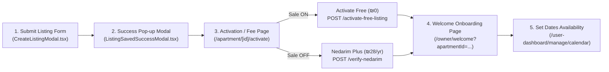

# ShabbosRent — First-Time Owner & Nedarim Plus Integration Guide
> **Comprehensive Guide:** First-Time Owner Flow, Nedarim Plus Iframe Fix, Promo Sale Toggle, and Complete Request/Response Specifications.

---

## 1. Flow Architecture



---

## 2. Why Nedarim Payment Form Was Not Loading (`X-Frame-Options: sameorigin`)

### Root Cause
You received:
```text
Refused to display 'https://matara.pro/' in a frame because it set 'X-Frame-Options' to 'sameorigin'.
```
- **Why this happens:** The root domain `https://matara.pro/` or `https://matara.pro` is the main Nedarim web portal. It sends HTTP header `X-Frame-Options: SAMEORIGIN` to prevent clickjacking and cannot be framed.
- **The Solution:** Nedarim Plus provides designated iframe embedding endpoints and query parameters. You must target the specific iframe endpoint:
  ```text
  https://matara.pro/nedarimplus/iframe?mosad={MOSAD_ID}&Amount={AMOUNT}&ClientName={CLIENT_NAME}&Mail={EMAIL}&Phone={PHONE}&Currency=1&Param1={APARTMENT_ID}
  ```
  *(or `https://matara.pro/nedarimplus/online.aspx?mosad={MOSAD_ID}`)*

### How Nedarim Plus PostMessage Works
When the user enters card details and clicks "Pay" inside the Nedarim iframe, Nedarim's iframe posts a `window.postMessage` event to the parent window:
```json
{
  "Status": "OK",
  "TransactionId": "12345678",
  "ConfirmationNo": "CONF-998877",
  "Amount": "28",
  "Param1": "apartment-id-here"
}
```
The frontend listens with `window.addEventListener('message', ...)` and forwards the `TransactionId` to the backend endpoint `POST /api/v1/payment/verify-nedarim`.

---

## 3. All API Endpoints & Request/Response Contracts

### A. Get Listing Fee Status (Promo Check)
- **URL**: `GET /api/v1/payment/listing-fee-status`
- **Auth**: Public (Optional Bearer token)
- **Headers**:
  ```http
  Accept: application/json
  ```
- **Response (200 OK - Promo ON)**:
  ```json
  {
    "statusCode": 200,
    "success": true,
    "message": "Listing fee status retrieved successfully",
    "data": {
      "standardFee": 28,
      "isOnSale": true,
      "effectiveFee": 0,
      "currency": "ILS"
    }
  }
  ```
- **Response (200 OK - Promo OFF)**:
  ```json
  {
    "statusCode": 200,
    "success": true,
    "message": "Listing fee status retrieved successfully",
    "data": {
      "standardFee": 28,
      "isOnSale": false,
      "effectiveFee": 28,
      "currency": "ILS"
    }
  }
  ```

---

### B. Activate Listing for Free (Promo Active)
- **URL**: `POST /api/v1/payment/activate-free-listing`
- **Auth**: Required (`Bearer <TOKEN>`)
- **Headers**:
  ```http
  Content-Type: application/json
  Authorization: Bearer <TOKEN>
  ```
- **Request Body**:
  ```json
  {
    "apartmentId": "c6a6f1d2-38b4-467a-a63e-908316274029"
  }
  ```
- **Response (200 OK)**:
  ```json
  {
    "statusCode": 200,
    "success": true,
    "message": "Listing activated for free under current promotion",
    "data": {
      "success": true,
      "apartmentId": "c6a6f1d2-38b4-467a-a63e-908316274029",
      "expiresAt": "2027-09-27T10:30:00.000Z",
      "transactionId": "PROMO-FREE-1790483147000-c6a6f1d2"
    }
  }
  ```
- **Error Response (403 Forbidden - if called when promo is OFF)**:
  ```json
  {
    "statusCode": 403,
    "success": false,
    "message": "Yearly fee promotion is not currently active. Please pay the standard listing fee."
  }
  ```

---

### C. Create Listing Payment Intent (For Nedarim Plus ₪28)
- **URL**: `POST /api/v1/payment/create-listing-intent`
- **Auth**: Required (`Bearer <TOKEN>`)
- **Headers**:
  ```http
  Content-Type: application/json
  Authorization: Bearer <TOKEN>
  ```
- **Request Body**:
  ```json
  {
    "apartmentId": "c6a6f1d2-38b4-467a-a63e-908316274029"
  }
  ```
- **Response (200 OK)**:
  ```json
  {
    "statusCode": 200,
    "success": true,
    "message": "Payment intent created successfully",
    "data": {
      "mosadId": "7001234",
      "amount": 28,
      "currency": "ILS",
      "paymentType": "APARTMENT_LISTING",
      "listingPaymentId": "pay-uuid-here",
      "apartmentId": "c6a6f1d2-38b4-467a-a63e-908316274029",
      "clientName": "David Cohen",
      "clientEmail": "david@example.com",
      "clientPhone": "0501234567",
      "validityDuration": "1 Year"
    }
  }
  ```

---

### D. Verify Nedarim Plus Transaction
- **URL**: `POST /api/v1/payment/verify-nedarim`
- **Auth**: Required (`Bearer <TOKEN>`)
- **Headers**:
  ```http
  Content-Type: application/json
  Authorization: Bearer <TOKEN>
  ```
- **Request Body**:
  ```json
  {
    "transactionId": "987654321",
    "paymentType": "APARTMENT_LISTING",
    "apartmentId": "c6a6f1d2-38b4-467a-a63e-908316274029"
  }
  ```
- **Response (200 OK)**:
  ```json
  {
    "statusCode": 200,
    "success": true,
    "message": "Listing payment verified successfully. Listing active for 1 year.",
    "data": {
      "paymentId": "pay-uuid-here",
      "apartmentId": "c6a6f1d2-38b4-467a-a63e-908316274029",
      "transactionId": "987654321",
      "status": "COMPLETED",
      "amount": 28,
      "currency": "ILS",
      "expiresAt": "2027-09-27T10:30:00.000Z"
    }
  }
  ```

---

### E. Admin: Toggle Yearly Fee Sale Promotion
- **URL**: `PATCH /api/v1/admin/settings/yearly-fee-sale` *(or `PATCH /api/v1/payment/admin/yearly-fee-sale`)*
- **Auth**: Required (`Bearer <SUPER_ADMIN_TOKEN>`)
- **Headers**:
  ```http
  Content-Type: application/json
  Authorization: Bearer <SUPER_ADMIN_TOKEN>
  ```
- **Request Body**:
  ```json
  {
    "isOnSale": true
  }
  ```
- **Response (200 OK)**:
  ```json
  {
    "statusCode": 200,
    "success": true,
    "message": "Yearly fee promotion enabled successfully",
    "data": {
      "isOnSale": true
    }
  }
  ```

---

## 4. Frontend Code: Nedarim Plus Iframe Component

Save this as `src/components/payment/NedarimPaymentModal.tsx` in your Next.js project:

```tsx
'use client';

import React, { useEffect, useState, useRef } from 'react';
import { X, ShieldCheck, Loader2 } from 'lucide-react';

interface NedarimPaymentModalProps {
  isOpen: boolean;
  onClose: () => void;
  apartmentId: string;
  onSuccess: (transactionId: string) => void;
}

interface PaymentIntentData {
  mosadId: string;
  amount: number;
  currency: string;
  apartmentId: string;
  clientName?: string;
  clientEmail?: string;
  clientPhone?: string;
}

export default function NedarimPaymentModal({
  isOpen,
  onClose,
  apartmentId,
  onSuccess,
}: NedarimPaymentModalProps) {
  const [loading, setLoading] = useState(true);
  const [intentData, setIntentData] = useState<PaymentIntentData | null>(null);
  const [verifying, setVerifying] = useState(false);
  const [errorMsg, setErrorMsg] = useState<string | null>(null);
  const iframeRef = useRef<HTMLIFrameElement>(null);

  // 1. Fetch Payment Intent to obtain MosadId & Amount
  useEffect(() => {
    if (!isOpen || !apartmentId) return;

    async function createIntent() {
      setLoading(true);
      setErrorMsg(null);
      try {
        const token = localStorage.getItem('token');
        const res = await fetch(`${process.env.NEXT_PUBLIC_API_URL}/api/v1/payment/create-listing-intent`, {
          method: 'POST',
          headers: {
            'Content-Type': 'application/json',
            Authorization: `Bearer ${token}`,
          },
          body: JSON.stringify({ apartmentId }),
        });
        const json = await res.json();
        if (json.success) {
          setIntentData(json.data);
        } else {
          setErrorMsg(json.message || 'Failed to initialize payment');
        }
      } catch (err: any) {
        setErrorMsg(err.message || 'Network error initializing payment');
      } finally {
        setLoading(false);
      }
    }

    createIntent();
  }, [isOpen, apartmentId]);

  // 2. Listen for postMessage from Nedarim Plus iframe
  useEffect(() => {
    if (!isOpen) return;

    const handleMessage = async (event: MessageEvent) => {
      // Validate origin if desired, or parse data
      try {
        let data = event.data;
        if (typeof data === 'string') {
          try {
            data = JSON.parse(data);
          } catch {
            // not JSON string
          }
        }

        // Nedarim sends transaction confirmation
        const isSuccess =
          data?.Status === 'OK' ||
          data?.Status === '1' ||
          data?.Status === 1 ||
          data?.Result === 'OK';

        const transactionId = data?.TransactionId || data?.ConfirmationNo || data?.transactionId;

        if (isSuccess && transactionId) {
          await verifyWithBackend(transactionId);
        }
      } catch (err) {
        console.error('Error handling Nedarim postMessage:', err);
      }
    };

    window.addEventListener('message', handleMessage);
    return () => window.removeEventListener('message', handleMessage);
  }, [isOpen, apartmentId]);

  // 3. Verify transaction with backend
  const verifyWithBackend = async (transactionId: string) => {
    setVerifying(true);
    try {
      const token = localStorage.getItem('token');
      const res = await fetch(`${process.env.NEXT_PUBLIC_API_URL}/api/v1/payment/verify-nedarim`, {
        method: 'POST',
        headers: {
          'Content-Type': 'application/json',
          Authorization: `Bearer ${token}`,
        },
        body: JSON.stringify({
          transactionId,
          paymentType: 'APARTMENT_LISTING',
          apartmentId,
        }),
      });

      const json = await res.json();
      if (json.success) {
        onSuccess(transactionId);
        onClose();
      } else {
        setErrorMsg(json.message || 'Payment verification failed');
      }
    } catch (err: any) {
      setErrorMsg(err.message || 'Verification request failed');
    } finally {
      setVerifying(false);
    }
  };

  if (!isOpen) return null;

  // Build the correct Nedarim Plus Iframe URL
  const mosadId = intentData?.mosadId || process.env.NEXT_PUBLIC_NEDARIM_MOSAD_ID || '7001234';
  const amount = intentData?.amount || 28;
  const clientName = encodeURIComponent(intentData?.clientName || '');
  const clientEmail = encodeURIComponent(intentData?.clientEmail || '');
  const clientPhone = encodeURIComponent(intentData?.clientPhone || '');

  // PROPER NEDARIM PLUS IFRAME URL (DO NOT use root https://matara.pro/)
  const iframeUrl = `https://matara.pro/nedarimplus/iframe?mosad=${mosadId}&Amount=${amount}&ClientName=${clientName}&Mail=${clientEmail}&Phone=${clientPhone}&Currency=1&Param1=${apartmentId}`;

  return (
    <div className="fixed inset-0 z-50 flex items-center justify-center bg-black/60 backdrop-blur-sm p-4">
      <div className="relative w-full max-w-xl bg-white rounded-2xl shadow-2xl overflow-hidden flex flex-col max-h-[90vh]">
        
        {/* Header */}
        <div className="flex items-center justify-between px-6 py-4 border-b border-slate-100 bg-slate-50">
          <div className="flex items-center space-x-2">
            <ShieldCheck className="w-5 h-5 text-emerald-600" />
            <h3 className="font-semibold text-slate-800">
              Nedarim Plus Secure Payment (₪{amount})
            </h3>
          </div>
          <button
            onClick={onClose}
            className="p-1 rounded-lg text-slate-400 hover:text-slate-600 hover:bg-slate-200/60 transition"
          >
            <X className="w-5 h-5" />
          </button>
        </div>

        {/* Body / Iframe */}
        <div className="relative flex-1 min-h-[480px] bg-slate-50">
          {loading && (
            <div className="absolute inset-0 flex flex-col items-center justify-center bg-white/90 z-10 space-y-3">
              <Loader2 className="w-8 h-8 text-blue-600 animate-spin" />
              <p className="text-sm font-medium text-slate-600">Loading secure checkout...</p>
            </div>
          )}

          {verifying && (
            <div className="absolute inset-0 flex flex-col items-center justify-center bg-white/95 z-20 space-y-3">
              <Loader2 className="w-9 h-9 text-emerald-600 animate-spin" />
              <p className="text-base font-semibold text-emerald-800">Verifying your payment with Nedarim Plus...</p>
              <p className="text-xs text-slate-500">Please do not close this window.</p>
            </div>
          )}

          {errorMsg ? (
            <div className="p-6 text-center">
              <p className="text-rose-600 font-medium mb-4">{errorMsg}</p>
              <button
                onClick={onClose}
                className="px-4 py-2 bg-slate-200 hover:bg-slate-300 text-slate-800 rounded-lg text-sm font-medium"
              >
                Close
              </button>
            </div>
          ) : (
            <iframe
              ref={iframeRef}
              src={iframeUrl}
              title="Nedarim Plus Payment"
              className="w-full h-full min-h-[480px] border-0"
              allow="payment"
            />
          )}
        </div>

        {/* Footer */}
        <div className="px-6 py-3 bg-slate-50 border-t border-slate-100 text-center">
          <p className="text-xs text-slate-500">
            🔒 256-bit encrypted checkout powered by Nedarim Plus. 365-day listing validity.
          </p>
        </div>
      </div>
    </div>
  );
}
```

---

## 5. Summary of Fixes Done in Backend

1. **New Database Persistence**:
   - Migration `add_app_settings` created `AppSetting` key/value model in PostgreSQL.
   - Promotion toggle key: `yearly_fee_on_sale`.

2. **Routes Added & Tested**:
   - `GET /api/v1/payment/listing-fee-status` (Public)
   - `POST /api/v1/payment/activate-free-listing` (Protected)
   - `PATCH /api/v1/admin/settings/yearly-fee-sale` & `PATCH /api/v1/payment/admin/yearly-fee-sale` (Super Admin)

3. **Compilation**:
   - `pnpm tsc --noEmit` verified with **0 errors**.
